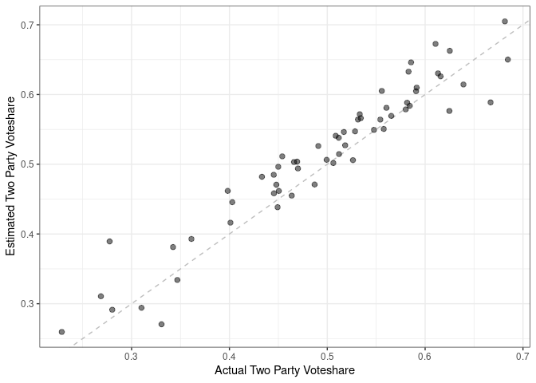

# A Naive 2022 Senate Forecast

I do not study elections. I am not a forecaster. So take what follows
accordingly.

There are a number of people who have built sophisticated and probably
quite fine election forecasting models. I wanted to see something a
little different. How close can I get with a *very naive* forecasting
model?

So first, what am I trying to forecast? I’m gonna go for the Democratic
two party voteshare, or

$$
\delta \triangleq \dfrac{\text{Number of Democratic Votes}}{\text{Number of Democratic Votes} + \text{Number of Republican Votes}}.
$$

Now like I said, for kicks I’m going to try to forecast
*δ**i* for each state *i* where there’s a Senate race in a
very unsophisticated way: Specifically, I’m only going to use
information voters have given me about whether they prefer to vote for
the Democrat or the Republican. This information comes in two flavors:
the information I had beforehand and what I’ve learned through the
campaign. This leads very naturally to a very simple Bayesian model,
where we place a Beta prior on *δ**i*, whose parameters are
shaped by election returns from past Senate races in state *i*, and
update our belief about *δ**i* using polls of the voters in
state *i* in the current election cycle. (Specifics about how the prior
parameters are calculated from past election returns are given for the
interested reader after the forecasting results are discussed).

### Model “Validation”

Since we have historical polls and election returns for the past couple
cycles of Senate elections, we can go ahead and see how this naive model
would have fared in 2018 and 2020 before seeing what its predictions for
tomorrow will be. (I omitted some cases to avoid dealing with wrinkles
for this simplified naive model; this is discussed at the end).

Surprisingly, the results are not *that* bad?? The dashed line here
represents if the estimated two party voteshare was *exactly* what we
actually observed, so one thing to notice is the model does overestimate
Democrats slightly since most of the points are just a bit on the
upper-left side of that line, but the points do track the line pretty
well actually.

<!-- -->

Here are how the races would have been classified vs the actual results:

    ##           Prediction
    ## Result     Dem lost Dem won
    ##   Dem lost       22       5
    ##   Dem won         0      33

This super simple model predicted 91.7% of 2018 and 2020 US Senate
elections correctly LMAO. **BUT**, notice that all the errors were
overestimating Democrats, so that’s something to be wary of. For
reference, here’s how far off the predictions were in those
classification misses:

| Year | State          | Actual voteshare | Estimated voteshare |
|-----:|:---------------|-----------------:|--------------------:|
| 2018 | FLORIDA        |        0.4993874 |           0.5063907 |
| 2018 | INDIANA        |        0.4691855 |           0.5037296 |
| 2020 | IOWA           |        0.4660038 |           0.5031730 |
| 2020 | MAINE          |        0.4539646 |           0.5113481 |
| 2020 | NORTH CAROLINA |        0.4908670 |           0.5261374 |

### Appendix: Setting the Prior Parameters

A Beta distribution is defined by two parameters, *a* and *b*. The mean
and variance of a Beta distribution are given by

$$
\mu = \dfrac{a}{a + b}
$$

and

$$
\sigma^2 = \dfrac{ab}{(a + b)^2 (a + b + 1)}
$$

respectively.

So we can use *the method of moments* to set *a* and *b* for our Beta
prior over *δ**i* by taking the election returns from the
last *N* (say 3) Senate elections in state *i* and setting *μ* equal to
their mean and *σ*2 equal to their variance, then solving for
*a* and *b* using the equations above.

### Appendix: Omitted cases

To avoid dealing with wrinkles in just what Democratic two party
voteshare means in elections where there’s multiple Democrats, I omit
races in California, Louisiana, and the 2020 Georgia special.
